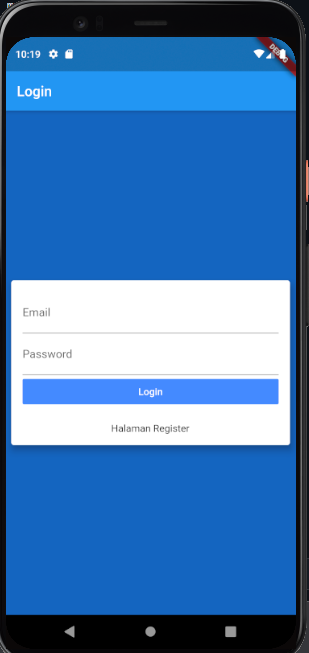
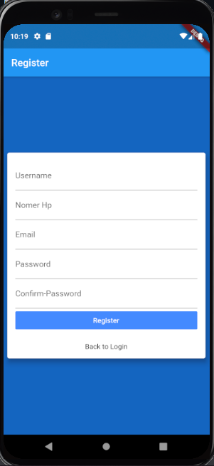

Rangkuman Pertemuan 10
==

Pada minggu ini saya mempelajari menggunakan metaapp pada extension flutter awesome untuk membuat template hello world .
kemudian membuat design untuk login menggunakna textformfield email dan password, untuk keyboardTypenya menggunakna email dan visible password.

seperti yang dibuat pada main.dart itu adalah menggunakan routes: { /login dan /register}
penggunaannya sama seperti pada route di laravel yaitu membuat prefix sebagai jalur perpindahan screen nantinya.
sebelum itu harus di importkan di bagian atas , yaitu file login.dart dan register.dart.
`import 'package:flutter_login/screen/login.dart';
import 'package:flutter_login/screen/register.dart';
`
setelah itu masuk ke halaman login,ditambahkan text di bagian bawah button login untuk pindah ke page register.
pada text di register di wrap with Widget,kemudian ganti dengan InkWell.
kemudain pada text di wrap with padding untuk memberikan jarak antara button login dengan InkWell.
InkWell sama seperti A href pada web. Kemudian di tambahkan atribut Ontaap(){ Navigator.pushnamed(context,'/register')}
2 fungsi yang di gunakan tadi adalah :
push : menimpa halaman sebelumnya dengan screen baru
pop : menampilkan halaman sebelumnya

jadi pada halaman login menggunakan navigator PushNamed kemudian di arahkan ke prefix /register
sedangkan di halaman register menggunakan navigator pop, karena setelah register nantinya akan langsung masuk kembali ke halaman login.
bisa menggunakan prefix seperti di halmaan login, tetapi lebih efektif menggunakan Pop.

link Git Repo : https://github.com/dwityantherrys/flutter_login

Halaman Login : 

Halaman Register : 
